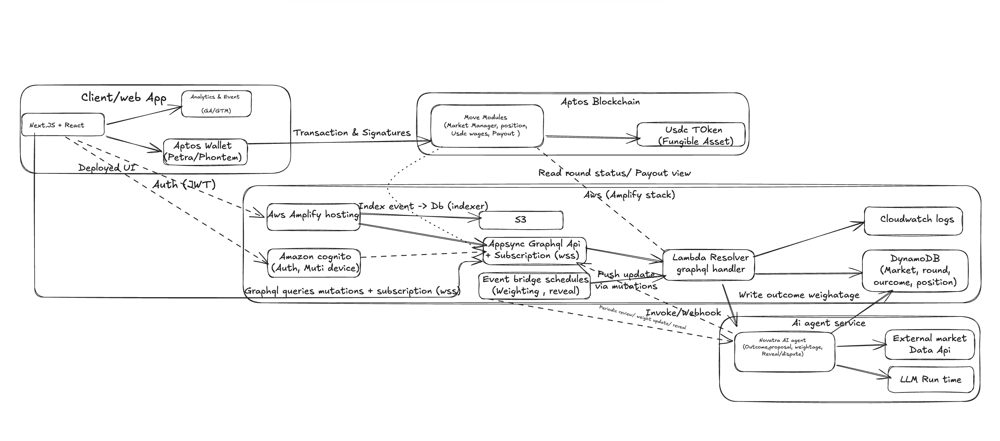

# Novatra — AI‑Powered Prediction Markets

**Predict, Stake, and Earn with Novatra AI.** Create custom, on‑chain prediction markets, leverage AI‑powered agents to propose & track outcomes, and enjoy **weighted payouts** that reward accurate forecasting. Currently available on **Aptos Testnet** — Mainnet and **Sui** support coming soon.

**Contract**
- https://github.com/ankit875/novatra/tree/develop/contracts/sources
---
## Architecture



The Novatra platform consists of three main layers:

1. **Frontend Layer** — Next.js application with React components, providing the user interface for market creation, predictions, and portfolio management
2. **AI Layer** — Intelligent agents that propose outcomes, track market developments, and assist with dispute resolution
3. **Blockchain Layer** — Aptos Move smart contracts handling market logic, USDC transactions, weighted payouts, and on-chain governance

---

## Key Features

- **Custom Markets** — Create markets on any topic that matters to you.
- **AI Agents** — Intelligent agents can propose outcomes and track them automatically.
- **Weighted Payouts** — Rewards scale with the accuracy/weight of the forecast.
- **Fair Disputes** — If a market can’t be resolved deterministically, stakes are refunded and the pot can roll over.
- **USDC Wagers + Multi‑Device Auth** — Stable accounting and secure access.
- **Aptos First** — Built for Aptos (Move). Testnet live; Mainnet & Sui on the roadmap.

---

## Repo Structure (suggested)

```
novatra/
├─ contracts/
│  ├─ Move.toml
│  └─ sources/
│     ├─ helpers/
│     │   ├─ base_fungible_asset.move      # novatra_market::base_fungible_asset
│     │   └─ mock_usdc_fa.move             # novatra_market::mock_usdc_fa (local test token)
│     └─ generalized.move                  # novatra_market::generalized (prediction market)
├─ src/                                    # Next.js app (Pages Router)
│  └─ pages/                               # pages router (index.tsx, api/*, etc.)
├─ components/
├─ lib/
├─ public/
├─ package.json
├─ next.config.js
└─ README.md
```

## AI Layer (high level)

- Agents help **propose** and **track** outcomes automatically.
- Weights (probabilities) drive **proportional payouts** to winners.
- Unclear outcomes can be **disputed**; stakes are refunded and may roll into the next round.

> Backends commonly use AppSync/Lambda or can be swapped for Supabase; on-chain logic targets **Aptos (Move)**.

---

## Getting Started

### Prerequisites
- **Node 18+** (or **Bun** if you prefer)
- **pnpm**/**yarn**/**npm** (project is Bun‑friendly)

### Install & Run

```bash
# 1) Install deps
bun install        # or: npm i | yarn | pnpm i

# 2) Start dev
bun dev            # or: npm run dev | yarn dev | pnpm dev
```

---

## Environment

Create a `.env.local` with the following (adjust to your infra):

```
NEXT_PUBLIC_NETWORK=aptos-testnet
NEXT_PUBLIC_API_URL=...              # GraphQL/API base
NEXT_PUBLIC_USDC_ADDRESS=...         # USDC token address (testnet)
```

---

## Scripts

- `dev` — start Next.js dev server
- `build` — production build
- `start` — run production server
- `lint` — lint sources

_Add the exact commands to `package.json` as needed._

---

## Contract Addresses

| Component | Address |
|-----------|---------|
| Package ID | `0x896f7c28432dc223478a0ff3e9325d23f97e8bc261c1896eab85ee20c1f66183` |
| Mock USDC | `0x74432d8fdde5be368d1fe3b717046e78bd712cc143000ccba136d2a16eb273be` |


## Roadmap

- [x] Aptos Testnet
- [ ] Aptos Mainnet
- [ ] Sui support
- [ ] In‑app AI agent surface for proposing outcomes
- [ ] On‑chain dispute evidence viewer
- [ ] Enhanced market discovery & search

---

## Contributing

1. Fork the repo
2. Create a feature branch: `feat/your-feature`
3. Open a PR with a clear description and screenshots if UI changes

---

## License

MIT © Novatra
